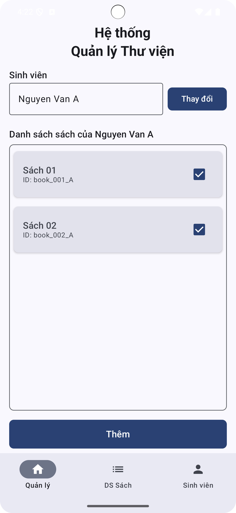
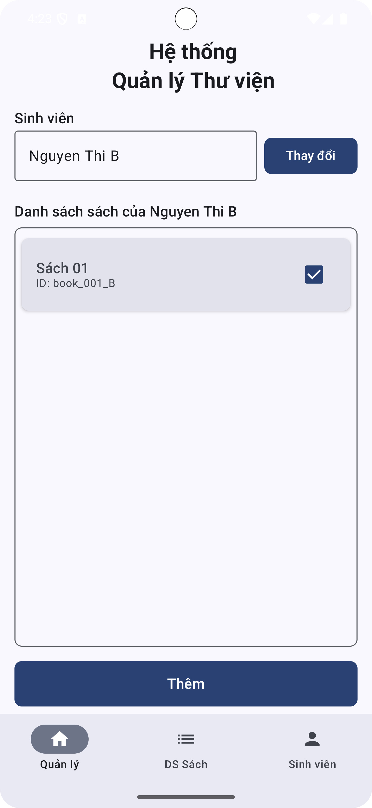
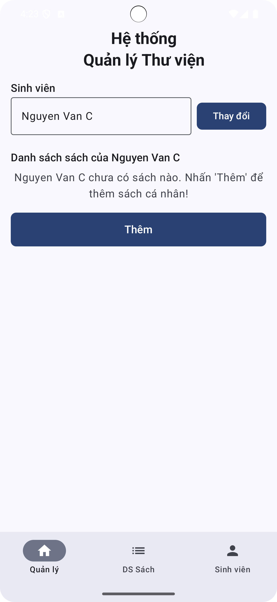

# Hệ Thống Quản Lý Thư Viện — Bài Tập Tuần 4

Ứng dụng quản lý thư viện đơn giản được xây dựng bằng Kotlin dành cho sinh viên thực hành lập trình hướng đối tượng (OOP) và thiết kế giao diện cơ bản.

---

## Mục tiêu bài tập

- Tạo danh sách sách.
- Tạo danh sách sinh viên.
- Cho phép sinh viên chọn mượn sách và hiển thị thông tin sách đã mượn.

---

## Công nghệ sử dụng

- Ngôn ngữ: Kotlin  
- IDE: Android Studio  
- UI: XML Layout hoặc Jetpack Compose  
- Android SDK: API 21+

---

## Hướng dẫn chạy ứng dụng

1. Mở Android Studio.
2. Chọn `File > Open` và trỏ đến thư mục chứa project (ví dụ: `BaiTapTuan4_ThuVien/`).
3. Chờ Android Studio sync Gradle hoàn tất.
4. Kết nối thiết bị thật hoặc AVD.
5. Nhấn nút **Run** hoặc dùng tổ hợp `Shift + F10` để chạy.

---

## Chức năng chính

- Tạo danh sách sinh viên mẫu: `Nguyen Van A`, `Nguyen Thi B`, `Nguyen Van C`.
- Tạo danh sách sách mẫu: `Sách 01`, `Sách 02`.
- Cho phép người dùng chọn tên sinh viên và hiển thị danh sách sách đã mượn.
- Nếu sinh viên chưa mượn sách, hiển thị thông báo: "Bạn chưa mượn quyền sách nào. Nhấn 'Thêm' để bắt đầu hành trình đọc sách!".
- Nút "Thêm" để cập nhật danh sách mượn.
- Thanh điều hướng dưới cùng gồm 3 tab: Quản lý | DS Sách | Sinh viên.

---

## Giao diện minh họa

Ảnh minh họa luồng quản lý mượn sách:

### Giao diện sinh viên A đã mượn 2 sách

### Giao diện sinh viên B đã mượn 1 sách

### Giao diện sinh viên C chưa mượn sách nào

*Lưu ý: Tên file ảnh phải đặt đúng như trên và nằm trong thư mục `images/`.*

---

## Yêu cầu nộp bài

- Tất cả thông tin và source code **phải được đẩy lên GitHub**.
- Repo phải chứa đầy đủ source code và ảnh minh họa.
- Cần ghi rõ thông tin sinh viên trong phần mô tả hoặc README.

---

## Thông tin sinh viên

- Bộ môn Lập trình thiết bị di động - UTH  
- Họ tên: Phan Phát Đạt
