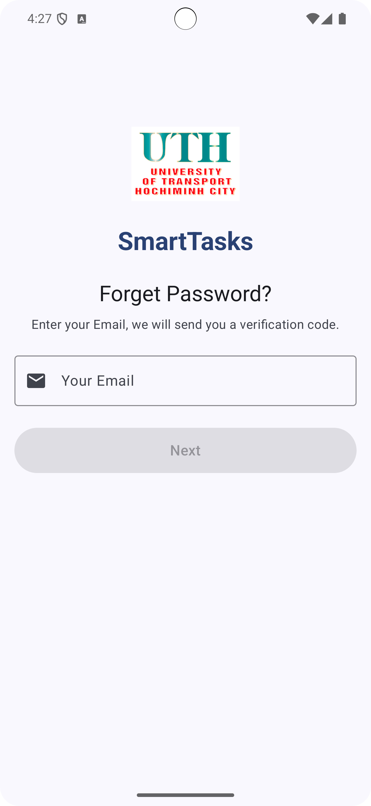
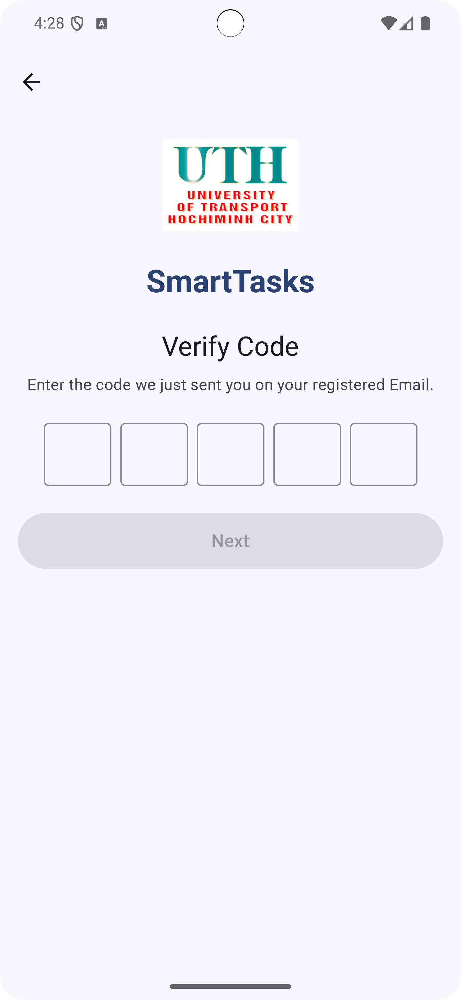
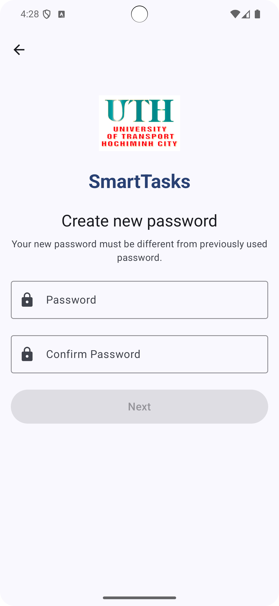
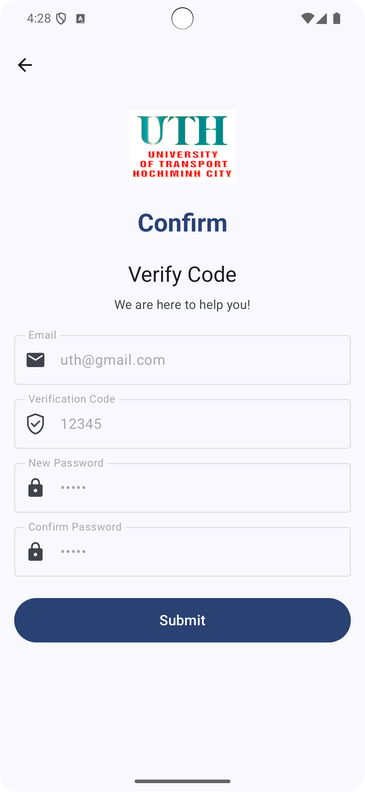

# SmartTasks — Bài Tập Tuần 4: Data Flow Navigation

Ứng dụng mô phỏng chức năng quên mật khẩu, giúp sinh viên nắm vững kỹ thuật truyền dữ liệu giữa các màn hình trong Android bằng Navigation Component.

---

## Mục tiêu bài tập

- Hiểu được cách luồng dữ liệu di chuyển giữa các màn hình trong ứng dụng.
- Thực hành truyền và nhận dữ liệu giữa các composable/màn hình.
- Hiển thị đầy đủ dữ liệu đầu vào trên màn hình xác nhận cuối cùng.

---

## Công nghệ sử dụng

- Ngôn ngữ: Kotlin  
- Giao diện: Jetpack Compose  
- Điều hướng: Navigation Component (Compose)  
- IDE: Android Studio Giraffe trở lên  
- Android SDK: API 21+

---

## Hướng dẫn chạy ứng dụng

1. Mở Android Studio.
2. Chọn `File > Open` và mở thư mục dự án (ví dụ: `SmartTasks_DataFlow/`).
3. Chờ Android Studio sync Gradle hoàn tất.
4. Kết nối thiết bị thật hoặc thiết lập AVD.
5. Nhấn **Run** hoặc sử dụng `Shift + F10` để chạy ứng dụng.

---

## Luồng màn hình (Data Flow)

| Màn hình             | Mô tả                                                                  |
|----------------------|------------------------------------------------------------------------|
| Forgot Password      | Nhập địa chỉ email để lấy mã xác thực.                                 |
| Verify Code          | Nhập mã xác thực được gửi đến email.                                   |
| Reset Password       | Nhập và xác nhận mật khẩu mới.                                         |
| Confirm              | Hiển thị lại toàn bộ thông tin đã nhập: email, mã, mật khẩu.           |

---

## Giao diện minh họa

### Màn hình 1: Nhập email

### Màn hình 2: Nhập mã xác thực

### Màn hình 3: Tạo mật khẩu mới

### Màn hình 4: Màn hình xác nhận thông tin

---

## Yêu cầu nộp bài

- Đầy đủ 4 màn hình với logic truyền dữ liệu chính xác.
- Dự án phải chạy được trên thiết bị thật hoặc AVD.
- Toàn bộ mã nguồn và hình ảnh minh họa **phải được đẩy lên GitHub**.
- Thêm thông tin sinh viên rõ ràng trong README hoặc phần mô tả repo.

---

## Thông tin sinh viên

- Bộ môn: Lập trình thiết bị di động - UTH  
- Họ tên: Phan Phát Đạt  
