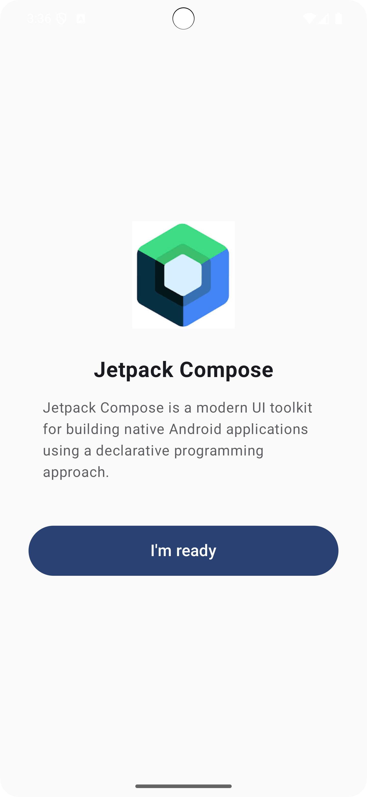

# BÀI TẬP: Tìm hiểu các thành phần UI cơ bản trong Jetpack Compose

## Mục tiêu
Sinh viên xây dựng một ứng dụng hiển thị danh sách các thành phần UI cơ bản sử dụng Jetpack Compose, đồng thời tự tìm hiểu và mô tả chức năng từng thành phần.

---

## Công nghệ sử dụng

- Ngôn ngữ: Kotlin  
- UI Framework: Jetpack Compose  
- IDE: Android Studio  
- Min SDK: 21  
- Sử dụng Material 3

---

## Danh sách thành phần UI đã triển khai

### Display
- `Text`: Hiển thị văn bản
- `Image`: Hiển thị hình ảnh
- `Button`: Nút bấm
- `Checkbox`: Hộp kiểm chọn
- `RadioButton`: Nút chọn 1 trong nhiều
- `Icon`: Hiển thị biểu tượng
- `ProgressBar`: Thanh tiến trình

### Input
- `TextField`: Trường nhập văn bản
- `PasswordField`: Trường nhập mật khẩu
- `Switch`: Nút gạt bật/tắt
- `Slider`: Thanh trượt
- `DropdownMenu`: Menu thả xuống chọn lựa

### Layout
- `Column`: Sắp xếp phần tử theo chiều dọc
- `Row`: Sắp xếp phần tử theo chiều ngang
- `Spacer`: Tạo khoảng trống giữa các phần tử
- `Card`: Thẻ chứa nội dung có bo góc và đổ bóng

### Action
- `IconButton`: Nút chỉ có biểu tượng
- `FloatingActionButton`: Nút hành động nổi (FAB)

### Feedback
- `Snackbar`: Thông báo tạm thời dưới màn hình
- `Dialog`: Hộp thoại tương tác

### Navigation
- `TopAppBar`: Thanh tiêu đề trên cùng
- `BottomNavigation`: Thanh điều hướng phía dưới
- `Drawer`: Bảng điều hướng trượt từ cạnh bên

### Container
- `Box`: Khối chứa tự do
- `Surface`: Vùng chứa có thể định nghĩa màu/nền/bóng
- `Scaffold`: Khung bố cục cơ bản (AppBar, FAB, Drawer...)

### Typography
- `AnnotatedString`: Văn bản có định dạng phong phú (in đậm, gạch chân, liên kết...)

---

## Giao diện demo

  
  
  
  
  

---

## Yêu cầu sinh viên

- Bổ sung thêm các thành phần UI chưa có nếu có thời gian.
- Viết mô tả hoặc ghi chú rõ ràng về chức năng mỗi thành phần UI.
- Mỗi thành phần nên có màn hình riêng (`Screen`) thể hiện ví dụ.

---

## Gợi ý mở rộng

- Kết hợp tương tác người dùng như `onClick`, `onChange`
- Dùng thêm animation để sinh động hơn
- Giao diện thân thiện và có nhóm rõ ràng theo từng nhóm UI

---

## Trường yêu cầu

**Trường Đại học Giao thông Vận tải TP.HCM (UTH)**  
**Môn học**: Lập trình thiết bị di động – Jetpack Compose  
