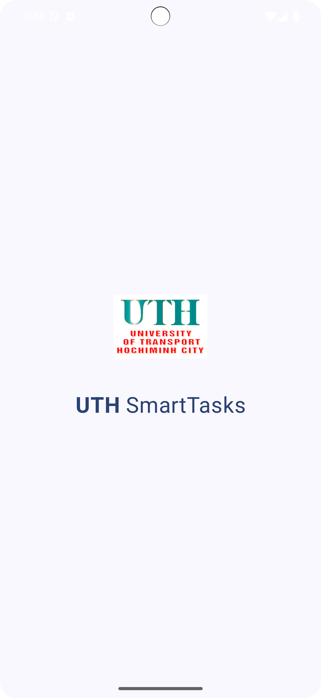
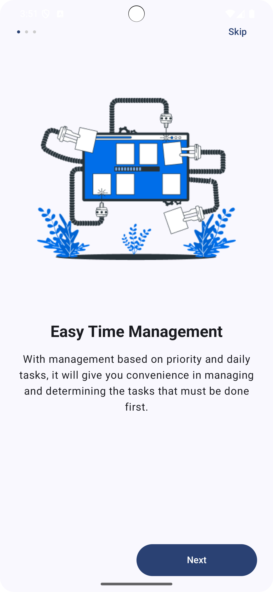

# UTH SmartTasks — Ứng dụng Quản Lý Công Việc

Ứng dụng demo quản lý công việc sử dụng Kotlin và Jetpack Compose, được phát triển trong khuôn khổ bài thực hành UI cơ bản của sinh viên Trường Đại học Giao thông Vận tải TP.HCM (UTH).

---

## Mục tiêu

Thiết kế giao diện người dùng (UI) theo luồng onboarding hiện đại, sử dụng Jetpack Compose Navigation, kết hợp kiến thức về lập trình hướng đối tượng (OOP).

---

## Công nghệ sử dụng

- Ngôn ngữ: Kotlin  
- UI Framework: Jetpack Compose  
- Điều hướng: Navigation Component (Compose)  
- Kiến trúc: ViewModel + State (nếu mở rộng)  
- IDE: Android Studio Giraffe trở lên  
- Min SDK: 21+

---

## Hướng dẫn chạy ứng dụng

1. Clone hoặc tải dự án về từ GitHub.
2. Mở project bằng Android Studio.
3. Kết nối thiết bị thật hoặc trình giả lập AVD.
4. Nhấn nút **Run** hoặc sử dụng tổ hợp phím `Shift + F10`.

---

## Luồng Onboarding (Navigation Flow)

| Màn hình     | Mô tả                                                                 |
|--------------|------------------------------------------------------------------------|
| Splash       | Logo ứng dụng "UTH SmartTasks" hiển thị trong 2 giây đầu.             |
| Onboarding 1 | Giới thiệu tính năng sắp xếp công việc thông minh.                   |
| Onboarding 2 | Tối ưu hiệu suất công việc và phân tích hiệu quả.                    |
| Onboarding 3 | Nhắc nhở người dùng hoàn thành công việc đúng hạn.                   |
| Get Started  | Kết thúc onboarding và chuyển đến màn hình chính.                    |

---

## Tính năng chính

- Splash Screen tự động chuyển hướng sau 2 giây.
- Giao diện onboarding hiện đại, hình ảnh trực quan.
- Sử dụng `NavHost` và `NavController` để điều hướng.
- Hỗ trợ các nút điều hướng: `Next`, `Skip`, `Get Started`.
- Áp dụng kiến thức lập trình hướng đối tượng (OOP) và quản lý trạng thái với Compose.

---

## Thời gian thực hành

- Thực hành 2 – 30 đến 35 phút  
- Nội dung: Navigation + OOP

---

## Giao diện demo

Ảnh minh họa luồng giao diện onboarding:

---

## Tài liệu tham khảo

- [Jetpack Compose Navigation](https://developer.android.com/jetpack/compose/navigation)  
- [Jetpack Compose State](https://developer.android.com/jetpack/compose/state)

---

## Thông tin tác giả

- Bộ môn Lập trình thiết bị di động - UTH  
- Sinh viên: Phan Phát Đạt  
