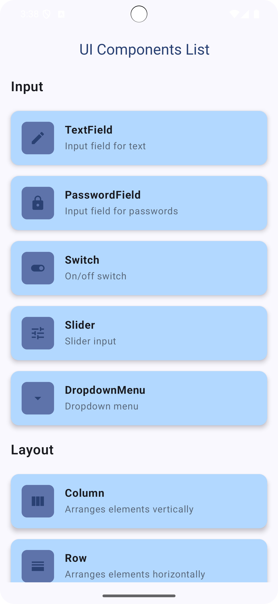
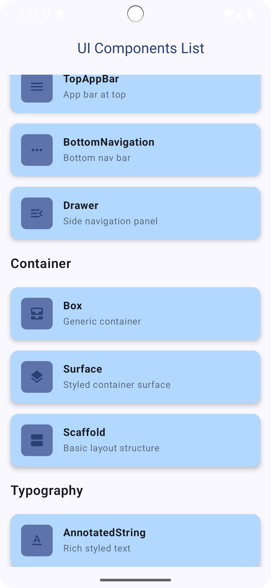

# Bài tập Thực hành Android Kotlin – UTH - Phan Phát Đạt

Đây là bộ bài tập thực hành cơ bản được thực hiện bằng ngôn ngữ Kotlin trên Android Studio.  
Sinh viên xây dựng một ứng dụng hiển thị danh sách các thành phần UI cơ bản sử dụng Jetpack Compose, đồng thời tự tìm hiểu và mô tả chức năng từng thành phần.

---

# BÀI TẬP: Tìm hiểu các thành phần UI cơ bản trong Jetpack Compose

## Mục tiêu

Xây dựng một ứng dụng Android sử dụng Jetpack Compose nhằm:

- Hiển thị danh sách các thành phần giao diện người dùng (UI) cơ bản.
- Giúp sinh viên làm quen với Jetpack Compose.
- Mỗi thành phần có ví dụ minh họa cụ thể và mô tả rõ ràng.

## Công nghệ sử dụng

- Ngôn ngữ lập trình: Kotlin  
- Giao diện: Jetpack Compose  
- Thư viện: Material Design 3  
- IDE: Android Studio  
- Min SDK: 21 trở lên

## Danh sách thành phần UI đã triển khai

### Display

- Text: Hiển thị văn bản
- Image: Hiển thị hình ảnh
- Button: Nút bấm cơ bản
- Checkbox: Hộp kiểm chọn
- RadioButton: Nút chọn một trong nhiều
- Icon: Hiển thị biểu tượng
- ProgressBar: Hiển thị tiến trình hoạt động

### Input

- TextField: Trường nhập liệu văn bản
- PasswordField: Trường nhập mật khẩu
- Switch: Nút gạt bật/tắt
- Slider: Thanh trượt
- DropdownMenu: Menu thả xuống chọn lựa

### Layout

- Column: Sắp xếp phần tử theo chiều dọc
- Row: Sắp xếp phần tử theo chiều ngang
- Spacer: Tạo khoảng cách giữa các phần tử
- Card: Thẻ chứa nội dung có bo góc và đổ bóng

### Action

- IconButton: Nút chỉ chứa biểu tượng
- FloatingActionButton: Nút hành động nổi hình tròn

### Feedback

- Snackbar: Thông báo ngắn dưới màn hình
- Dialog: Hộp thoại hiển thị nội dung xác nhận

### Navigation

- TopAppBar: Thanh tiêu đề trên cùng
- BottomNavigation: Thanh điều hướng ở dưới
- Drawer: Bảng điều hướng trượt từ cạnh bên

### Container

- Box: Khối chứa tự do, căn chỉnh linh hoạt
- Surface: Bề mặt giao diện có thể tùy chỉnh màu, viền, bóng
- Scaffold: Bố cục giao diện cơ bản bao gồm AppBar, FAB, Drawer...

### Typography

- AnnotatedString: Văn bản có thể định dạng nhiều kiểu (in đậm, nghiêng, liên kết, gạch chân, v.v.)

---

## Giao diện minh họa

Giao diện ứng dụng hiển thị các thành phần UI:

- Màn hình chính liệt kê các thành phần theo nhóm
- Mỗi thành phần có màn hình ví dụ riêng

Hình ảnh minh họa:

  
  
  
  
  

---

## Yêu cầu sinh viên

- Viết chú thích mô tả chức năng của mỗi thành phần UI.
- Mỗi thành phần có một màn hình riêng sử dụng `@Composable`.
- Có thể mở rộng thêm các thành phần khác nếu có thời gian.

---

## Gợi ý mở rộng

- Thêm tương tác người dùng như `onClick`, `onValueChange`, v.v.
- Áp dụng animation hoặc hiệu ứng chuyển động
- Tổ chức bố cục thân thiện, rõ ràng theo từng nhóm UI
- Hỗ trợ chế độ sáng/tối (Light/Dark Theme)

---

## Thông tin lớp học

- Trường: Đại học Giao thông Vận tải TP.HCM (UTH)  
- Môn học: Lập trình thiết bị di động – Jetpack Compose  

---

## Hướng dẫn chạy ứng dụng

1. Mở Android Studio.
2. Chọn `File > Open`, trỏ tới thư mục dự án: `BTVN_Tuan_3/`
3. Chờ quá trình Sync Gradle hoàn tất.
4. Kết nối thiết bị ảo (AVD) hoặc thiết bị thật.
5. Nhấn **Run** hoặc tổ hợp phím `Shift + F10` để chạy ứng dụng.

---
