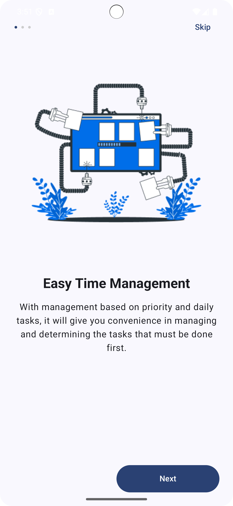

# Bộ Bài Tập Tuần 4 — UTH Mobile Development

Tổng hợp ba bài thực hành sử dụng ngôn ngữ Kotlin trong phát triển ứng dụng Android, giúp sinh viên Trường Đại học Giao thông Vận tải TP.HCM (UTH) rèn luyện các kỹ năng về UI, Navigation và OOP.

---
## 1. Ứng Dụng Quản Lý Công Việc — SmartTasks Onboarding

### Mục tiêu:
- Thiết kế luồng onboarding hiện đại bằng Jetpack Compose.
- Tập trung vào Navigation và thiết kế giao diện người dùng.

### Công nghệ:
- Kotlin, Jetpack Compose, Android Studio Giraffe+, Min SDK 21+

### Luồng màn hình:
| Màn hình     | Mô tả                          |
|--------------|--------------------------------|
| Splash       | Hiển thị logo 2 giây đầu       |
| Onboarding 1 | Tính năng sắp xếp công việc    |
| Onboarding 2 | Phân tích hiệu suất            |
| Onboarding 3 | Nhắc nhở hoàn thành task       |
| Get Started  | Chuyển đến màn chính           |

### Giao diện minh họa:

---
## 2. Ứng Dụng Quản Lý Thư Viện

### Mục tiêu:
- Tạo danh sách sách và sinh viên.
- Cho phép chọn sách để mượn và hiển thị thông tin tương ứng.

### Công nghệ:
- Kotlin, Android Studio, XML hoặc Jetpack Compose.

### Chức năng chính:
- Tạo sẵn danh sách sinh viên: Nguyễn Văn A, Nguyễn Thị B, Nguyễn Văn C.
- Mượn sách, hiển thị danh sách đã mượn.
- Thông báo nếu chưa mượn sách nào.
- Điều hướng với 3 tab: Quản lý | DS Sách | Sinh viên.

### Giao diện minh họa:
-  → Sinh viên A mượn 2 sách  
-  → Sinh viên B mượn 1 sách  
-  → Sinh viên C chưa mượn sách  

---
## 3. Ứng Dụng Reset Mật Khẩu — SmartTasks Data Flow

### Mục tiêu:
- Thực hành truyền dữ liệu giữa các màn hình.
- Hiển thị thông tin đã nhập trong màn hình xác nhận.

### Công nghệ:
- Kotlin, Jetpack Compose, Navigation Compose.

### Luồng màn hình:
| Màn hình         | Mô tả                          |
|------------------|--------------------------------|
| Forgot Password  | Nhập email                     |
| Verify Code      | Nhập mã xác thực               |
| Reset Password   | Nhập mật khẩu mới              |
| Confirm          | Xác nhận lại thông tin đã nhập |

### Giao diện minh họa:
-  → Nhập email  
-  → Nhập mã  
-  → Mật khẩu mới  
-  → Xác nhận thông tin  

---

## Yêu cầu nộp bài (áp dụng cho cả 3 bài)

- Đảm bảo dự án chạy được trên thiết bị thật hoặc AVD.
- Push toàn bộ mã nguồn và hình ảnh demo lên GitHub.
- Ghi rõ thông tin sinh viên trong README.

---

## Thông tin sinh viên

- Bộ môn: Lập trình thiết bị di động - UTH  
- Họ tên: Phan Phát Đạt